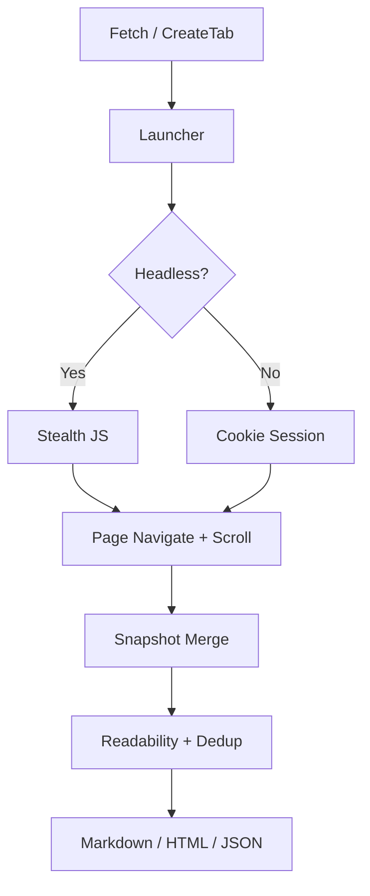

> [!NOTE]
> This README was generated by [SKILL](https://github.com/agenvoy/skill-readme-generate), get the ZH version from [here](./doc/README.zh.md).

***

<strong>HEADLESS BROWSER AUTOMATION FOR GO — STEALTH, SESSIONS, AND SMART CONTENT EXTRACTION</strong>

***

> A Go library with stealth anti-detection, Chrome cookie session injection, and multi-snapshot content extraction

## Table of Contents

- [Features](#features)
- [Architecture](#architecture)
- [License](#license)
- [Author](#author)

## Features

> `go get github.com/pardnchiu/go-browser` · [Documentation](./doc/doc.md)

- **Stealth Anti-Detection** — Built-in stealth.js injection and AutomationControlled bypass to reduce interception by Cloudflare and similar protections.
- **Chrome Cookie Session Injection** — Extracts and decrypts cookies from the local Chrome profile, injecting them into a temporary browser instance to access login-required pages.
- **Multi-Snapshot Merge** — Simulates scrolling behavior, captures multiple page snapshots, and merges with deduplication to fully extract dynamically loaded content.
- **Interactive Tab Operations** — Supports creating tabs, clicking, typing, scrolling, executing JavaScript, and taking snapshots for form filling and multi-step workflows.
- **Multi-Format Output** — Obtain Markdown, HTML, or structured JSON tree from a single request, with built-in readability parsing and paragraph deduplication.

## Architecture

> [Full Architecture](./doc/architecture.md)

## License

This project is licensed under the [MIT LICENSE](LICENSE).

## Author

<h4 style="padding-top: 0">邱敬幃 Pardn Chiu</h4>

<a href="mailto:hi@pardn.dev">hi@pardn.dev</a> 
<a href="https://linkedin.com/in/pardnchiu">https://linkedin.com/in/pardnchiu</a>

***

©️ 2025 [邱敬幃 Pardn Chiu](https://linkedin.com/in/pardnchiu)