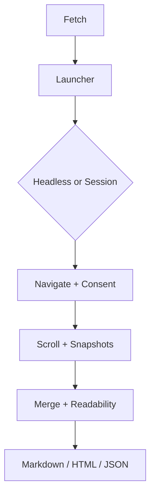

> [!NOTE]
> This README was generated by [SKILL](https://github.com/agenvoy/skill-readme-generate), get the ZH version from [here](./doc/README.zh.md).

***

<strong>EXTRACT WEB CONTENT VIA CHROME — MARKDOWN OR HTML, READY FOR AGENTS</strong>

***

> A Go library that extracts web content via Chrome with optional Markdown or HTML and cookie sessions

## Table of Contents

- [Features](#features)
- [Architecture](#architecture)
- [License](#license)
- [Author](#author)

## Features

> `go get github.com/pardnchiu/go-browser` · [Documentation](./doc/doc.md)

- **Chrome Content Extraction** — Opens pages with local Chrome or Chromium and returns Markdown or HTML; use Playwright MCP for full CDP workflows.
- **Multi-Snapshot Merge** — Scrolls, captures multiple snapshots, then merges and deduplicates to cover dynamically loaded content.
- **Chrome Cookie Sessions** — Decrypts cookies from the local Chrome profile and injects them to read login-required pages.
- **Attempt Cookie Consent Dismissal** — After load, attempts to close consent banners without promising success on every site.
- **Headless and UA Isolation** — Isolates browsers by headless mode and User-Agent, falling back to headed only on 403, 429, or 503 blocks.

## Architecture

> [Full Architecture](./doc/architecture.md)

## License

This project is licensed under the [MIT LICENSE](LICENSE).

## Author

Just [open an issue](https://github.com/pardnchiu/go-browser/issues/new) to share an idea.

---

©️ 2026 [邱敬幃 Pardn Chiu](https://www.linkedin.com/in/pardnchiu)
