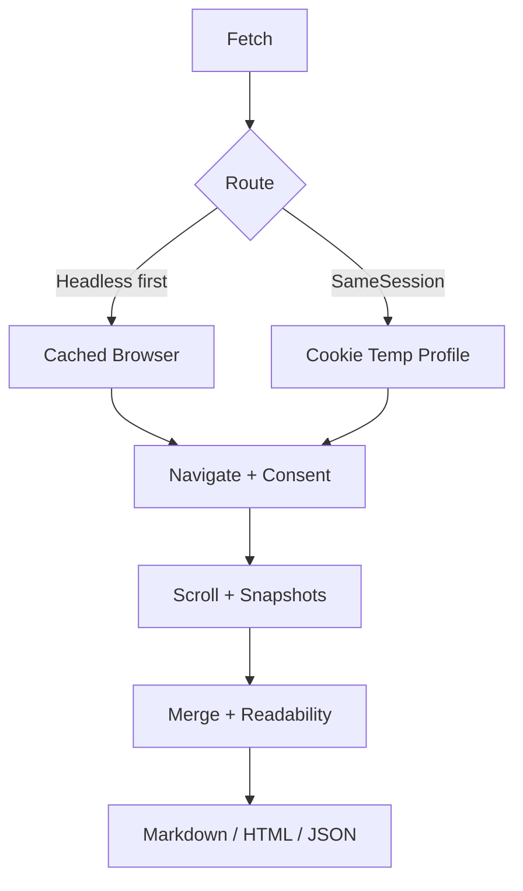

Last updated: 2026-10-06

> [!NOTE]
> This README was generated by [SKILL](https://github.com/agenvoy/skill-readme-generate), get the ZH version from [here](./doc/README.zh.md).

***

<strong>EXTRACT WEB CONTENT VIA CHROME — MARKDOWN OR HTML, READY FOR AGENTS</strong>

***

> A Go web content extraction library with JavaScript-rendered page scraping, HTML to Markdown for LLMs, and Chrome cookie sessions

## Table of Contents

- [Features](#features)
- [Architecture](#architecture)
- [License](#license)
- [Author](#author)

## Features

> `go get github.com/pardnchiu/go-browser/core` · [Documentation](./doc/doc.md)

- **Chrome Content Extraction** — Renders pages with local Chrome or Chromium and returns Markdown, merged HTML, or a JSON node tree, passing JSON and XML responses through untouched.
- **Multi-Snapshot Merge** — Scrolls and captures a snapshot per step, then merges and deduplicates them to recover lazy-loaded and infinite-scroll content.
- **Chrome Cookie Sessions** — Decrypts cookies from the local Chrome profile and injects them into a temporary browser to read login-required pages.
- **Attempt Cookie Consent Dismissal** — Runs up to two passes to close consent banners and reports the outcome in `Consent`, without promising success on every site.
- **Headless-First Isolation** — Isolates browser instances by headless mode and User-Agent, retrying headed only on 403, 429, or 503 blocks when a display exists.

## Architecture

> [Full Architecture](./doc/architecture.md)

```mermaid
graph TB
    A[Fetch] --> B{Route}
    B -->|Headless first| C[Cached Browser]
    B -->|SameSession| D[Cookie Temp Profile]
    C --> E[Navigate + Consent]
    D --> E
    E --> F[Scroll + Snapshots]
    F --> G[Merge + Readability]
    G --> H[Markdown / HTML / JSON]
```

## License

This project is licensed under the [MIT LICENSE](LICENSE).

## Author

Just [open an issue](https://github.com/pardnchiu/go-browser/issues/new) to share an idea.

***

©️ 2026 [邱敬幃 Pardn Chiu](https://www.linkedin.com/in/pardnchiu)
