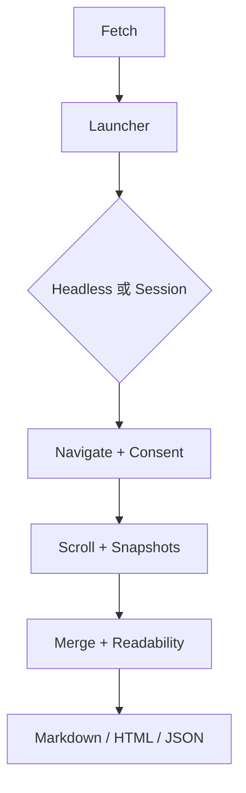

> [!NOTE]
> 此 README 由 [SKILL](https://github.com/agenvoy/skill-readme-generate) 生成，英文版請參閱 [這裡](../README.md)。

***

<strong>EXTRACT WEB CONTENT VIA CHROME — MARKDOWN OR HTML, READY FOR AGENTS</strong>

***

> Go 函式庫，透過 Chrome 萃取網頁內容，可選 Markdown／HTML，並支援 Cookie 工作階段

## 目錄

- [功能特點](#功能特點)
- [架構](#架構)
- [授權](#授權)
- [Author](#author)

## 功能特點

> `go get github.com/pardnchiu/go-browser` · [完整文件](./doc.zh.md)

- **Chrome 內容萃取** — 以本機 Chrome／Chromium 開啟頁面，輸出可選 Markdown 或 HTML，完整 CDP 工作流請改用 Playwright MCP。
- **多快照合併** — 模擬捲動並擷取多份快照，合併後去重，補齊動態載入內容。
- **Chrome Cookie 工作階段** — 從本機 Chrome 設定檔解密並注入 Cookie，讀取需登入的頁面。
- **嘗試關閉 Cookie 橫幅** — 載入後自動嘗試關閉同意橫幅，不保證所有網站皆可成功。
- **Headless／UA 隔離** — 依 headless 與 User-Agent 隔離瀏覽器，僅在 403／429／503 被擋時改用 headed。

## 架構

> [完整架構](./architecture.zh.md)

## 授權

本專案採用 [MIT LICENSE](../LICENSE)。

## Author

有想法就直接 [開 issue](https://github.com/pardnchiu/go-browser/issues/new)。

---

©️ 2026 [邱敬幃 Pardn Chiu](https://www.linkedin.com/in/pardnchiu)
