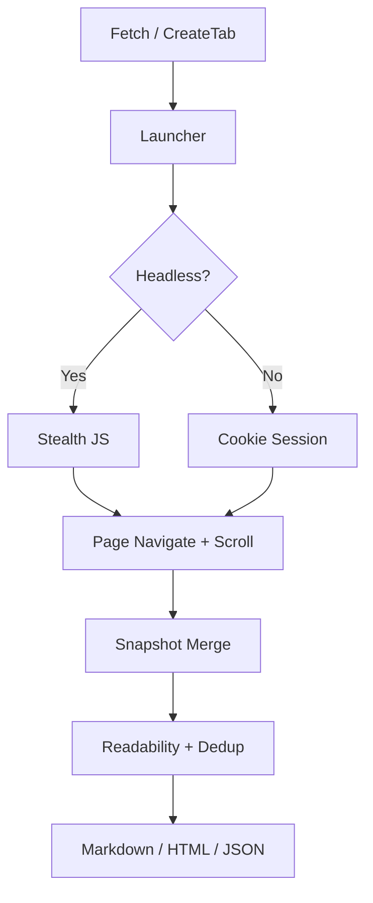

> [!NOTE]
> 此 README 由 [SKILL](https://github.com/agenvoy/skill-readme-generate) 生成，英文版請參閱 [這裡](../README.md)。

***

<strong>HEADLESS BROWSER AUTOMATION FOR GO — STEALTH, SESSIONS, AND SMART CONTENT EXTRACTION</strong>

***

> Go 函式庫，具備反偵測隱匿模式、Chrome Cookie 會話注入與多頁面快照合併提取

## 目錄

- [功能特點](#功能特點)
- [架構](#架構)
- [授權](#授權)
- [Author](#author)

## 功能特點

> `go get github.com/pardnchiu/go-browser` · [完整文件](./doc.zh.md)

- **反偵測隱匿模式** — 內建 stealth.js 注入與 AutomationControlled 偵測繞過，降低被 Cloudflare 等防護攔截的機率。
- **Chrome Cookie 會話注入** — 從本機 Chrome 設定檔提取並解密 Cookie，自動注入至臨時瀏覽器實例以存取需登入的頁面。
- **多頁面快照合併** — 模擬滾動瀏覽行為，多次截取頁面快照後合併去重，完整提取動態載入內容。
- **互動式分頁操作** — 支援建立分頁、點擊、輸入文字、滾動、執行 JavaScript 與快照擷取，適用於表單填寫與多步驟工作流程。
- **多格式內容輸出** — 一次請求可取得 Markdown、HTML 或結構化 JSON 樹，內建 readability 解析與段落去重。

## 架構

> [完整架構](./architecture.zh.md)

## 授權

本專案採用 [MIT LICENSE](../LICENSE)。

## Author

<h4 style="padding-top: 0">邱敬幃 Pardn Chiu</h4>

<a href="mailto:hi@pardn.dev">hi@pardn.dev</a> 
<a href="https://linkedin.com/in/pardnchiu">https://linkedin.com/in/pardnchiu</a>

***

©️ 2025 [邱敬幃 Pardn Chiu](https://linkedin.com/in/pardnchiu)
