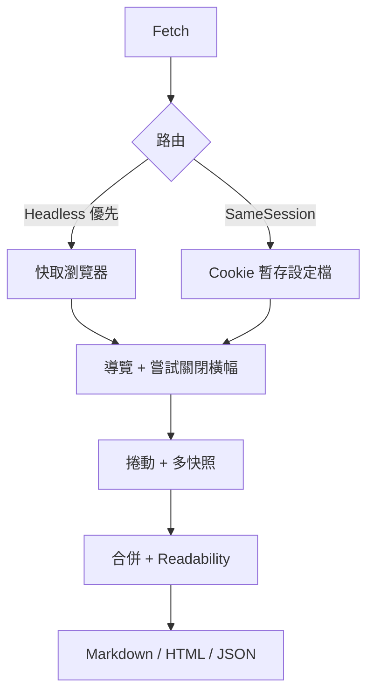

最後更新：2026-10-06

> [!NOTE]
> 此 README 由 [SKILL](https://github.com/agenvoy/skill-readme-generate) 生成，英文版請參閱 [這裡](../README.md)。

***

<strong>EXTRACT WEB CONTENT VIA CHROME — MARKDOWN OR HTML, READY FOR AGENTS</strong>

***

> Go 網頁擷取函式庫：Chrome 渲染動態頁面、擷取主要內容並將網頁轉 Markdown

## 目錄

- [功能特點](#功能特點)
- [架構](#架構)
- [授權](#授權)
- [Author](#author)

## 功能特點

> `go get github.com/pardnchiu/go-browser/core` · [完整文件](./doc.zh.md)

- **Chrome 內容萃取** — 以本機 Chrome／Chromium 渲染頁面，輸出 Markdown、合併後 HTML 或 JSON 結構樹，JSON／XML 回應則原樣直出。
- **多快照合併** — 模擬捲動並逐次擷取快照，合併後去重，補齊 lazy-load 與無限捲動才出現的內容。
- **Chrome Cookie 工作階段** — 從本機 Chrome 設定檔解密 Cookie 並注入暫存瀏覽器，讀取需登入的頁面。
- **嘗試關閉 Cookie 橫幅** — 載入後最多兩輪嘗試關閉同意橫幅，結果回報於 `Consent`，不保證所有網站皆可成功。
- **Headless 優先與隔離** — 依 headless 與 User-Agent 隔離瀏覽器實例，僅在 403／429／503 被擋且有顯示器時改用 headed 重試。

## 架構

> [完整架構](./architecture.zh.md)

```mermaid
graph TB
    A[Fetch] --> B{路由}
    B -->|Headless 優先| C[快取瀏覽器]
    B -->|SameSession| D[Cookie 暫存設定檔]
    C --> E[導覽 + 嘗試關閉橫幅]
    D --> E
    E --> F[捲動 + 多快照]
    F --> G[合併 + Readability]
    G --> H[Markdown / HTML / JSON]
```

## 授權

本專案採用 [MIT LICENSE](../LICENSE)。

## Author

Just [open an issue](https://github.com/pardnchiu/go-browser/issues/new) to share an idea.

***

©️ 2026 [邱敬幃 Pardn Chiu](https://www.linkedin.com/in/pardnchiu)
