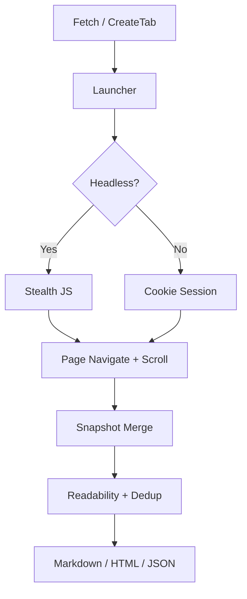
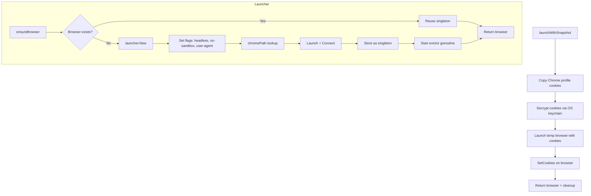
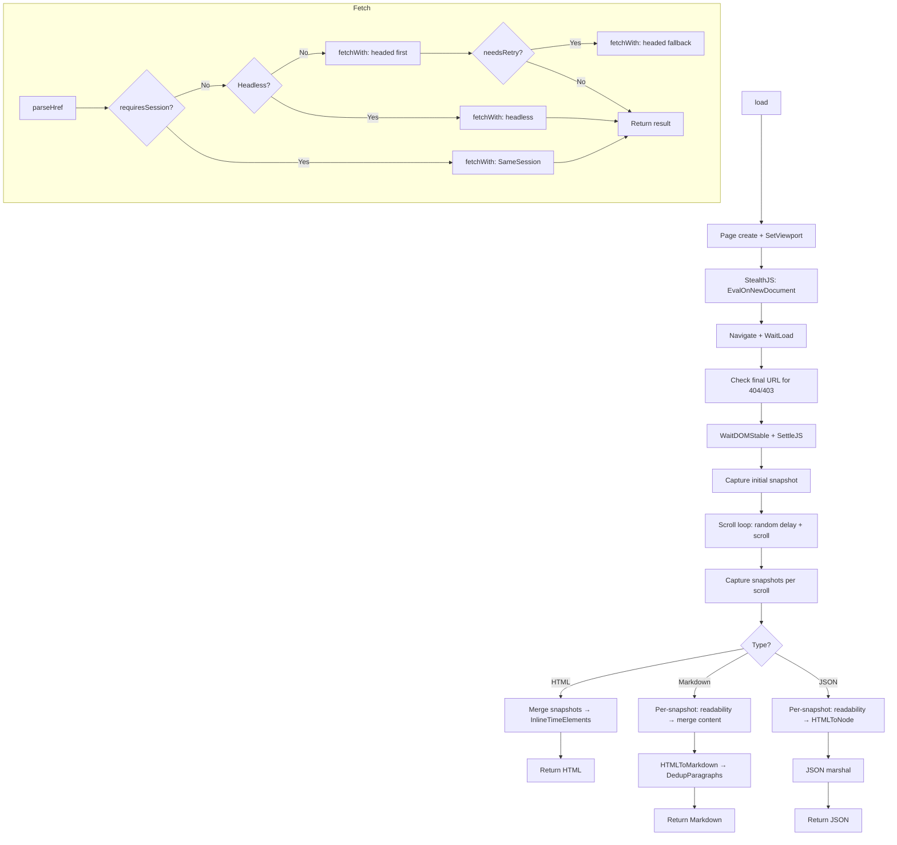
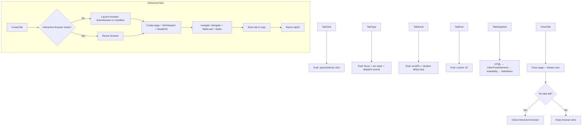
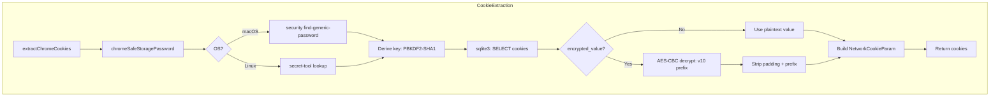
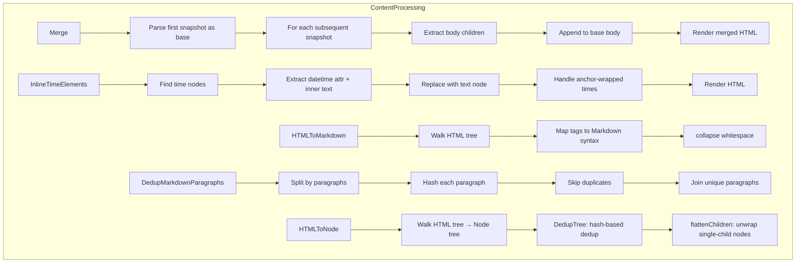
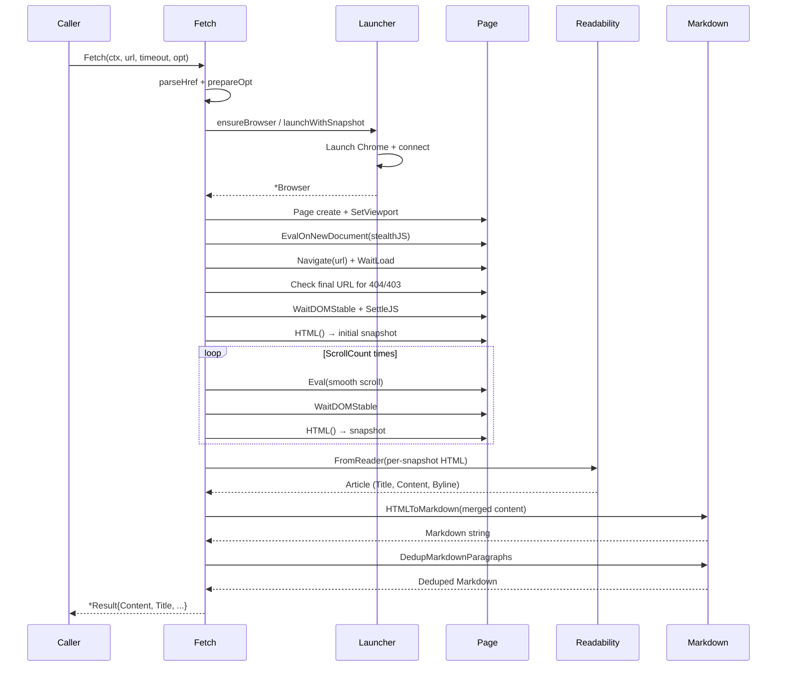

# go-browser - Architecture

> Back to [README](../README.md)

## Overview

## Module: Launcher

Manages Chrome browser lifecycle — singleton headless instance with idle eviction, or temporary profile-snapshot instances with cookie injection.

## Module: Fetch

Core content extraction pipeline — navigates to a URL, simulates scrolling, captures multiple snapshots, and produces Markdown/HTML/JSON output.

## Module: Interactive Tabs

Stateful tab management for multi-step browser interactions — click, type, scroll, eval, and snapshot.

## Module: Cookie Extraction

Cross-platform Chrome cookie decryption — extracts cookies from the local Chrome profile SQLite database and decrypts them using OS keychain credentials.

## Module: Content Processing

HTML processing pipeline — snapshot merging, time element inlining, readability extraction, Markdown conversion, and deduplication.

## Data Flow

***

©️ 2025 [邱敬幃 Pardn Chiu](https://linkedin.com/in/pardnchiu)