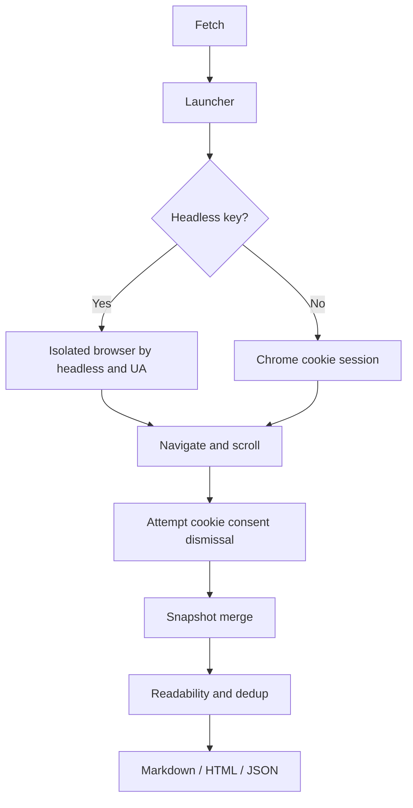
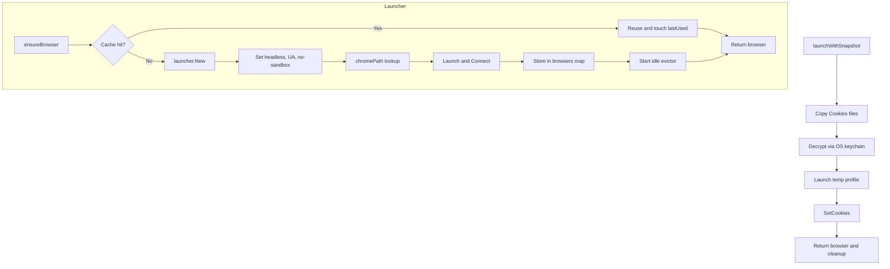
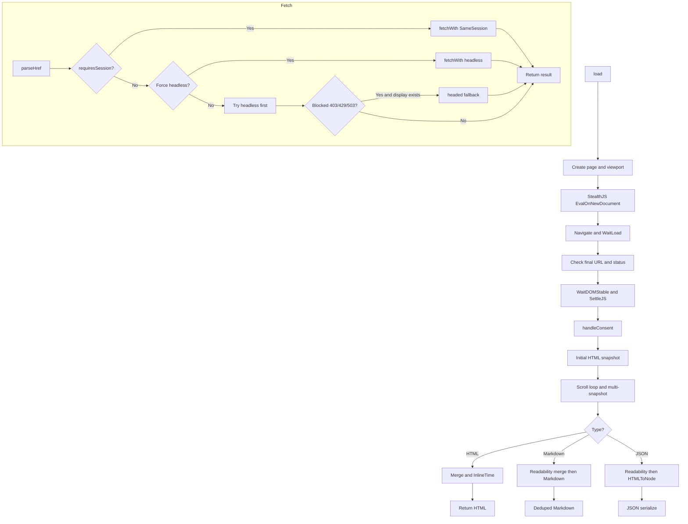
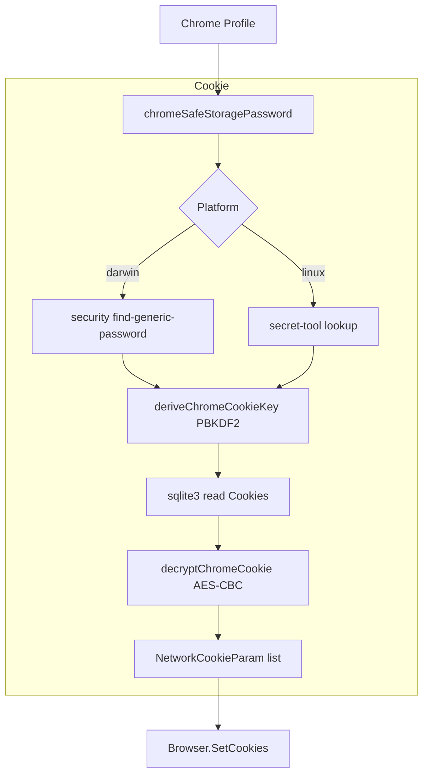
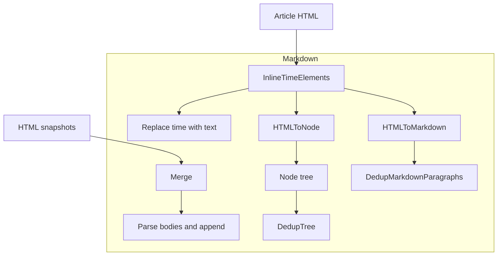
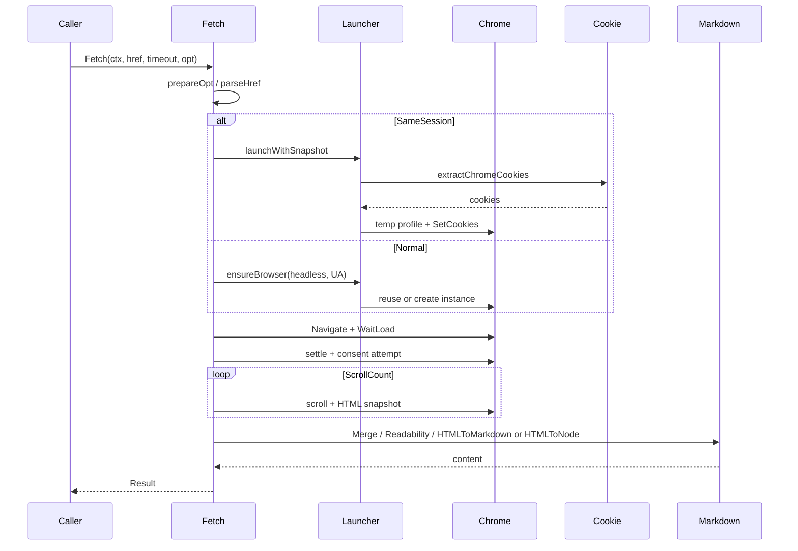
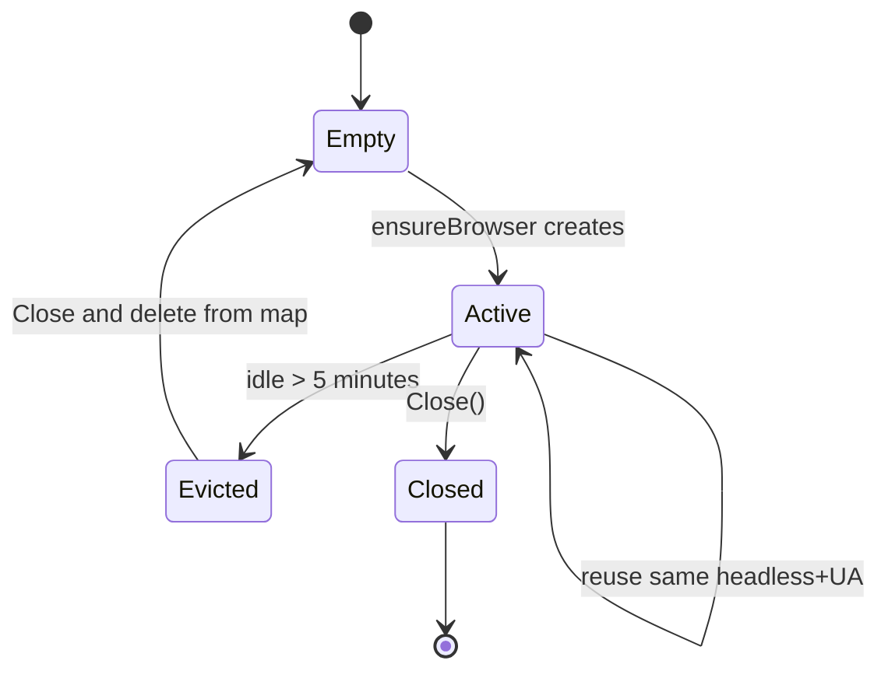

# go-browser - Architecture

> Back to [README](../README.md)

## Overview

## Module: Launcher

Manages Chrome lifecycle by headless and User-Agent keys, with reusable instances and temporary profiles that can receive injected cookies.

## Module: Fetch

Core extraction pipeline: navigate, wait for stability, attempt consent dismissal, merge snapshots, and emit Markdown, HTML, or JSON.

## Module: Cookie

Decrypts cookies from the local Chrome profile for SameSession injection into a temporary browser.

## Module: Markdown

HTML merge, time-element inlining, structured nodes, and Markdown paragraph deduplication.

## Data Flow

## State Machine: Browser Cache

***

©️ 2026 [邱敬幃 Pardn Chiu](https://www.linkedin.com/in/pardnchiu)
