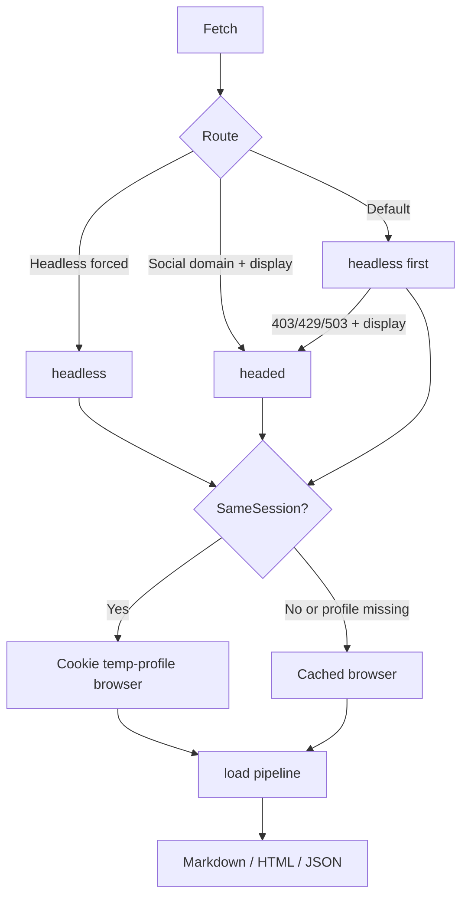
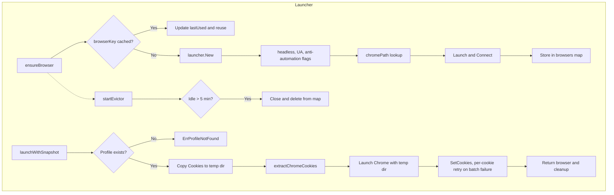
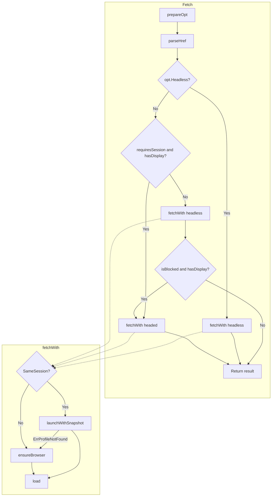
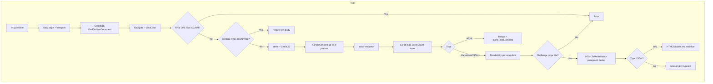
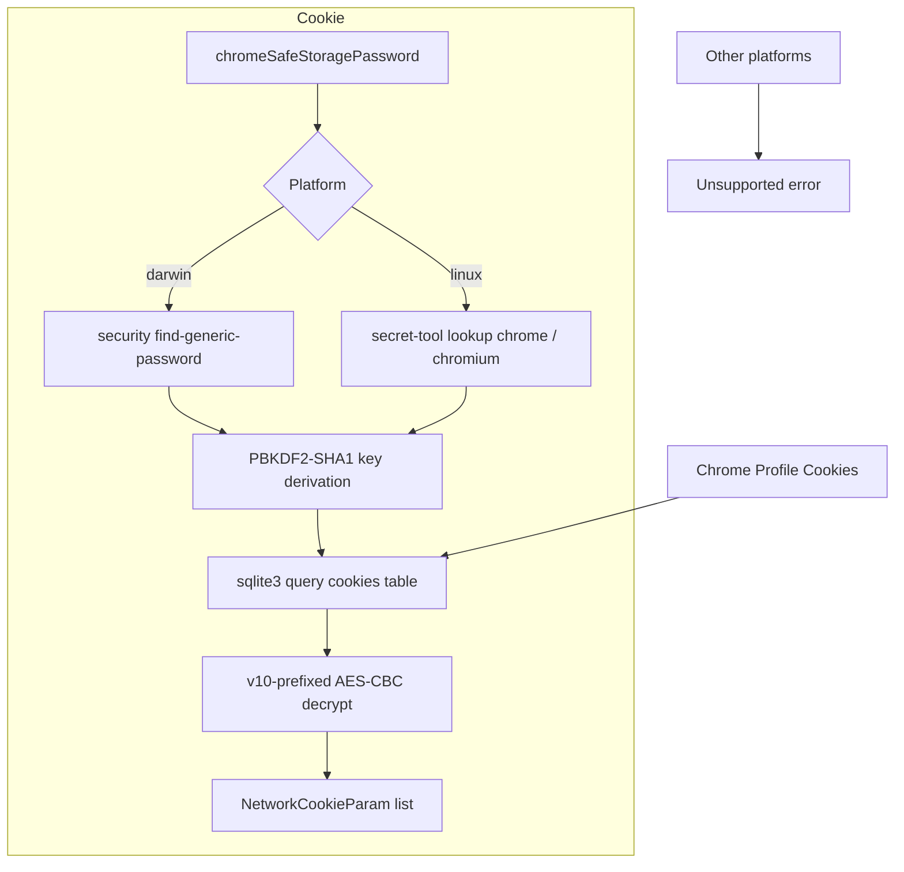
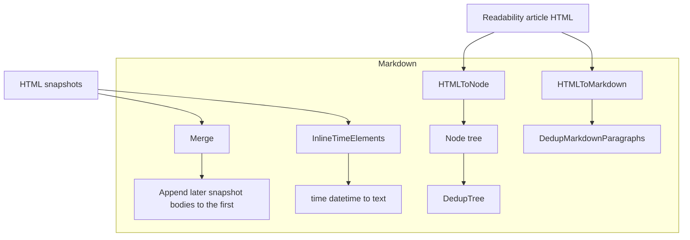
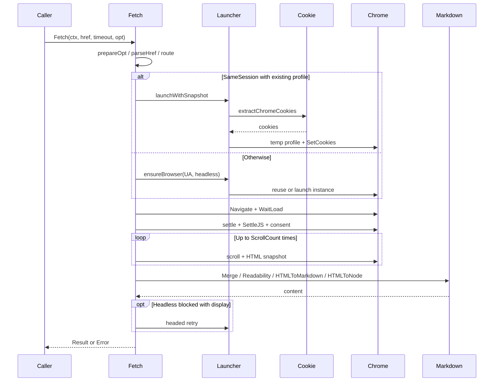
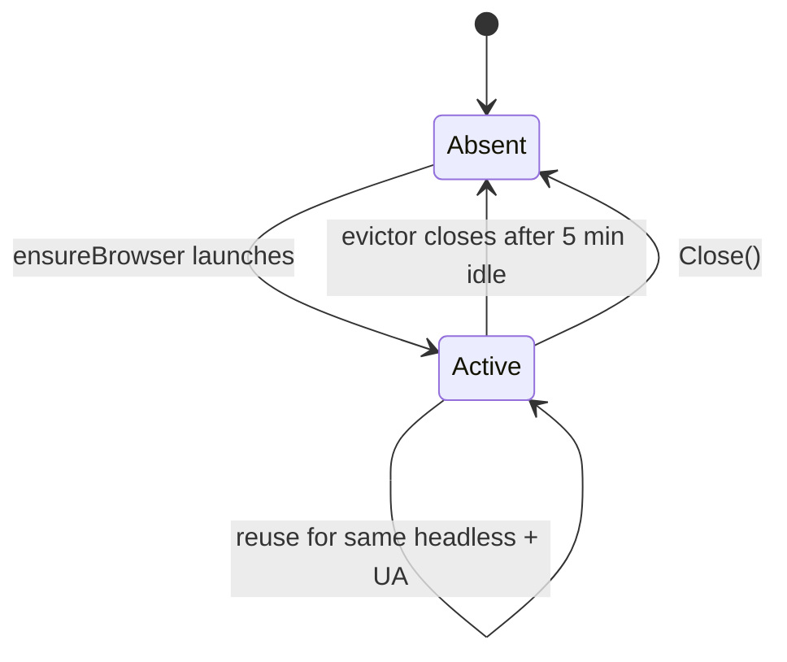

# go-browser - Architecture

Last updated: 2026-10-06

> Back to [README](../README.md)

## Overview

```mermaid
graph TB
    A[Fetch] --> B{Route}
    B -->|Headless forced| C[headless]
    B -->|Social domain + display| D[headed]
    B -->|Default| E[headless first]
    E -->|403/429/503 + display| D
    C --> F{SameSession?}
    D --> F
    E --> F
    F -->|Yes| G[Cookie temp-profile browser]
    F -->|No or profile missing| H[Cached browser]
    G --> I[load pipeline]
    H --> I
    I --> J[Markdown / HTML / JSON]
```

## Module: Launcher

Manages the Chrome lifecycle: caches reusable instances by headless mode and User-Agent, or launches a single-use temp-profile instance with injected cookies.

```mermaid
graph TB
    subgraph Launcher
        A[ensureBrowser] --> B{browserKey cached?}
        B -->|Yes| C[Update lastUsed and reuse]
        B -->|No| D[launcher.New]
        D --> E[headless, UA, anti-automation flags]
        E --> F[chromePath lookup]
        F --> G[Launch and Connect]
        G --> H[Store in browsers map]
        I[startEvictor] --> J{Idle > 5 min?}
        J -->|Yes| K[Close and delete from map]
        L[launchWithSnapshot] --> M{Profile exists?}
        M -->|No| N[ErrProfileNotFound]
        M -->|Yes| O[Copy Cookies to temp dir]
        O --> P[extractChromeCookies]
        P --> Q[Launch Chrome with temp dir]
        Q --> R[SetCookies, per-cookie retry on batch failure]
        R --> S[Return browser and cleanup]
    end
    A -.-> I
```

## Module: Fetch

Routes between headless and headed, then runs navigation, settling, consent handling, multi-snapshot capture, and format conversion.

```mermaid
graph TB
    subgraph Fetch
        A[prepareOpt] --> B[parseHref]
        B --> C{opt.Headless?}
        C -->|Yes| D[fetchWith headless]
        C -->|No| E{requiresSession and hasDisplay?}
        E -->|Yes| F[fetchWith headed]
        E -->|No| G[fetchWith headless]
        G --> H{isBlocked and hasDisplay?}
        H -->|Yes| F
        H -->|No| I[Return result]
        D --> I
        F --> I
    end
    subgraph fetchWith
        J{SameSession?} -->|Yes| K[launchWithSnapshot]
        K -->|ErrProfileNotFound| L[ensureBrowser]
        J -->|No| L
        K --> M[load]
        L --> M
    end
    D -.-> J
    F -.-> J
    G -.-> J
```

## Module: load Pipeline

```mermaid
graph TB
    subgraph load
        A[acquireSem] --> B[New page + Viewport]
        B --> C[StealthJS EvalOnNewDocument]
        C --> D[Navigate + WaitLoad]
        D --> E{Final URL has 403/404?}
        E -->|Yes| X[Error]
        E -->|No| F{Content-Type JSON/XML?}
        F -->|Yes| Y[Return raw body]
        F -->|No| G[settle + SettleJS]
        G --> H[handleConsent up to 2 passes]
        H --> I[Initial snapshot]
        I --> J[Scroll loop ScrollCount times]
        J --> K{Type}
        K -->|HTML| L[Merge + InlineTimeElements]
        K -->|Markdown/JSON| M[Readability per snapshot]
        M --> N{Challenge page title?}
        N -->|Yes| X
        N -->|No| O[HTMLToMarkdown + paragraph dedup]
        O --> P{Type JSON?}
        P -->|Yes| Q[HTMLToNode and serialize]
        P -->|No| R[MaxLength truncate]
    end
```

## Module: Cookie

Decrypts cookies from the local Chrome profile for SameSession injection; supports darwin and linux only.

```mermaid
graph TB
    subgraph Cookie
        A[chromeSafeStoragePassword] --> B{Platform}
        B -->|darwin| C[security find-generic-password]
        B -->|linux| D[secret-tool lookup chrome / chromium]
        C --> E[PBKDF2-SHA1 key derivation]
        D --> E
        E --> F[sqlite3 query cookies table]
        F --> G[v10-prefixed AES-CBC decrypt]
        G --> H[NetworkCookieParam list]
    end
    Profile[Chrome Profile Cookies] --> F
    Other[Other platforms] --> Unsupported[Unsupported error]
```

## Module: Markdown

Merges HTML snapshots, inlines time elements, converts to a node tree, and deduplicates.

```mermaid
graph TB
    subgraph Markdown
        A[Merge] --> B[Append later snapshot bodies to the first]
        C[InlineTimeElements] --> D[time datetime to text]
        E[HTMLToNode] --> F[Node tree]
        F --> G[DedupTree]
        H[HTMLToMarkdown] --> I[DedupMarkdownParagraphs]
    end
    Snapshots[HTML snapshots] --> A
    Snapshots --> C
    Article[Readability article HTML] --> E
    Article --> H
```

## Data Flow

```mermaid
sequenceDiagram
    participant Caller
    participant Fetch
    participant Launcher
    participant Cookie
    participant Chrome
    participant Markdown
    Caller->>Fetch: Fetch(ctx, href, timeout, opt)
    Fetch->>Fetch: prepareOpt / parseHref / route
    alt SameSession with existing profile
        Fetch->>Launcher: launchWithSnapshot
        Launcher->>Cookie: extractChromeCookies
        Cookie-->>Launcher: cookies
        Launcher->>Chrome: temp profile + SetCookies
    else Otherwise
        Fetch->>Launcher: ensureBrowser(UA, headless)
        Launcher->>Chrome: reuse or launch instance
    end
    Fetch->>Chrome: Navigate + WaitLoad
    Fetch->>Chrome: settle + SettleJS + consent
    loop Up to ScrollCount times
        Fetch->>Chrome: scroll + HTML snapshot
    end
    Fetch->>Markdown: Merge / Readability / HTMLToMarkdown / HTMLToNode
    Markdown-->>Fetch: content
    opt Headless blocked with display
        Fetch->>Launcher: headed retry
    end
    Fetch-->>Caller: Result or Error
```

## State Machine: Cached Browser

```mermaid
stateDiagram-v2
    [*] --> Absent
    Absent --> Active: ensureBrowser launches
    Active --> Active: reuse for same headless + UA
    Active --> Absent: evictor closes after 5 min idle
    Active --> Absent: Close()
```

***

©️ 2026 [邱敬幃 Pardn Chiu](https://www.linkedin.com/in/pardnchiu)
