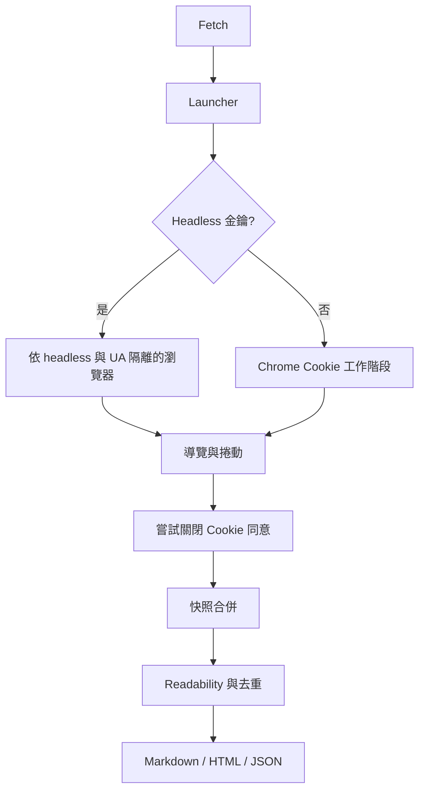
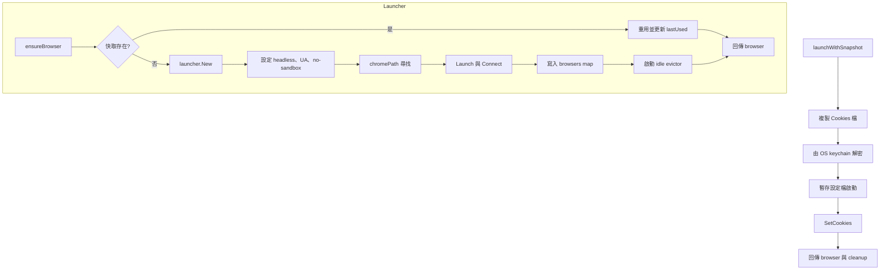
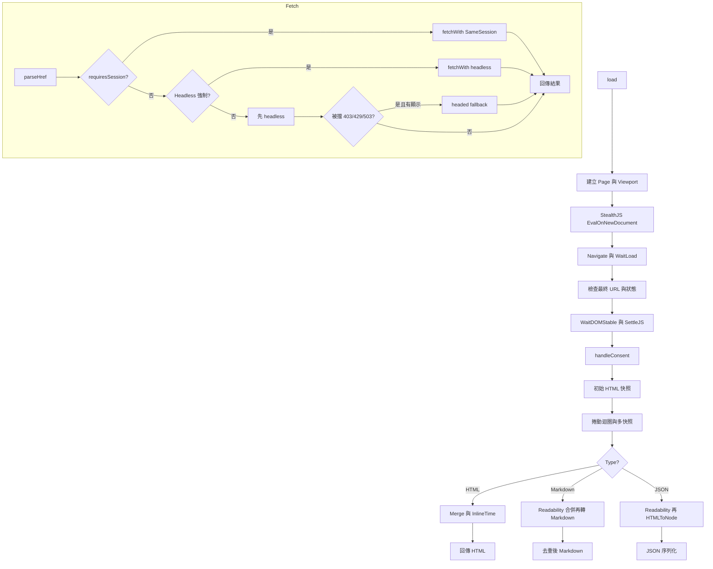
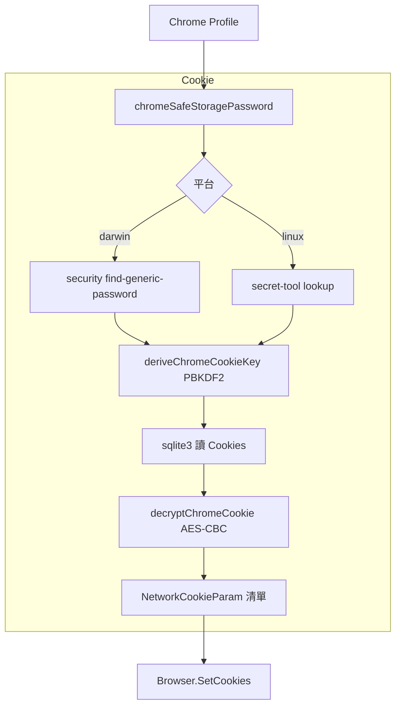
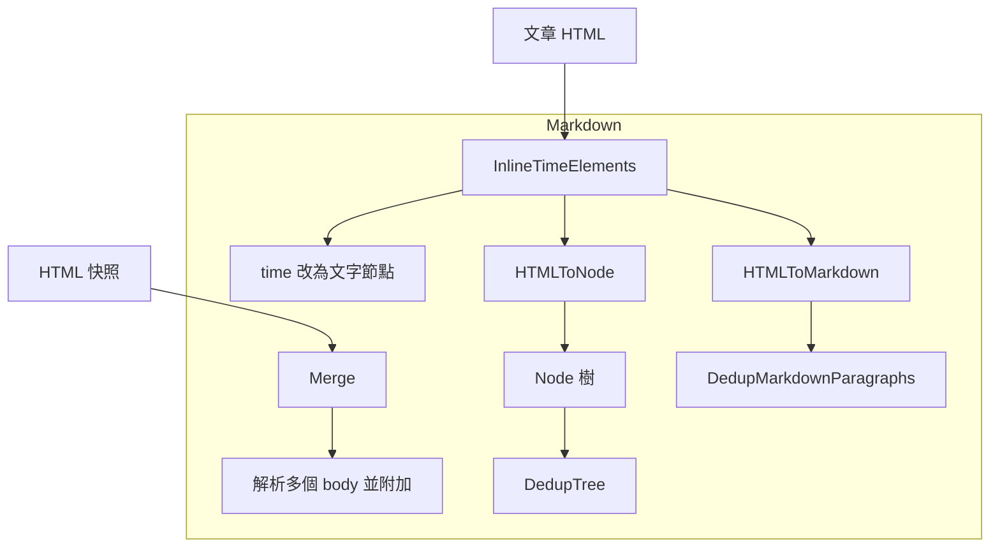
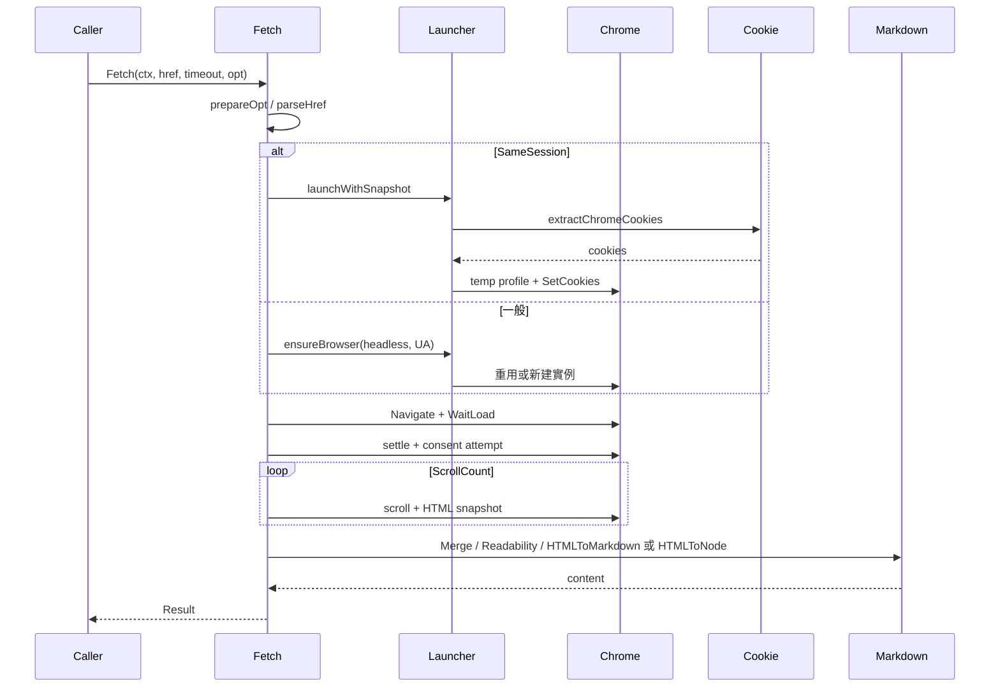
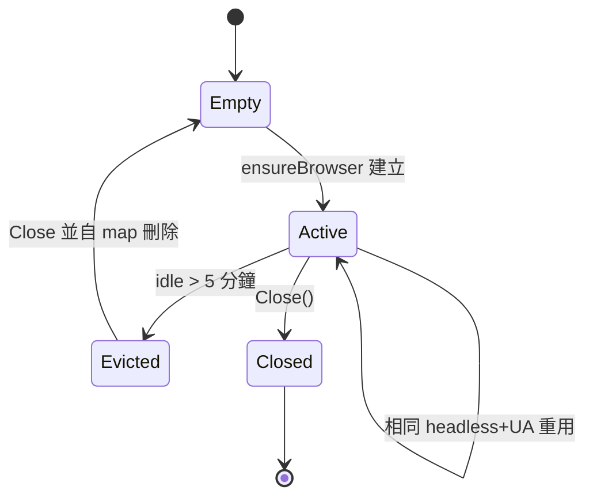

# go-browser - 架構

> 返回 [README](./README.zh.md)

## 概覽

## 模組：Launcher

依 headless 與 User-Agent 管理 Chrome 生命週期，提供可重用實例與可注入 Cookie 的暫時設定檔。

## 模組：Fetch

核心內容萃取管線：導覽、穩定等待、嘗試關閉同意橫幅、多快照合併，並輸出 Markdown、HTML 或 JSON。

## 模組：Cookie

從本機 Chrome 設定檔解密 Cookie，供 SameSession 模式注入暫存瀏覽器。

## 模組：Markdown

HTML 合併、時間元素內嵌、結構化節點與 Markdown 去重。

## 資料流

## 狀態機：瀏覽器快取

***

©️ 2026 [邱敬幃 Pardn Chiu](https://www.linkedin.com/in/pardnchiu)
