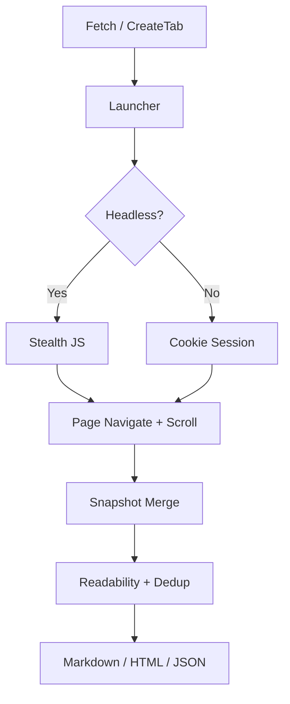
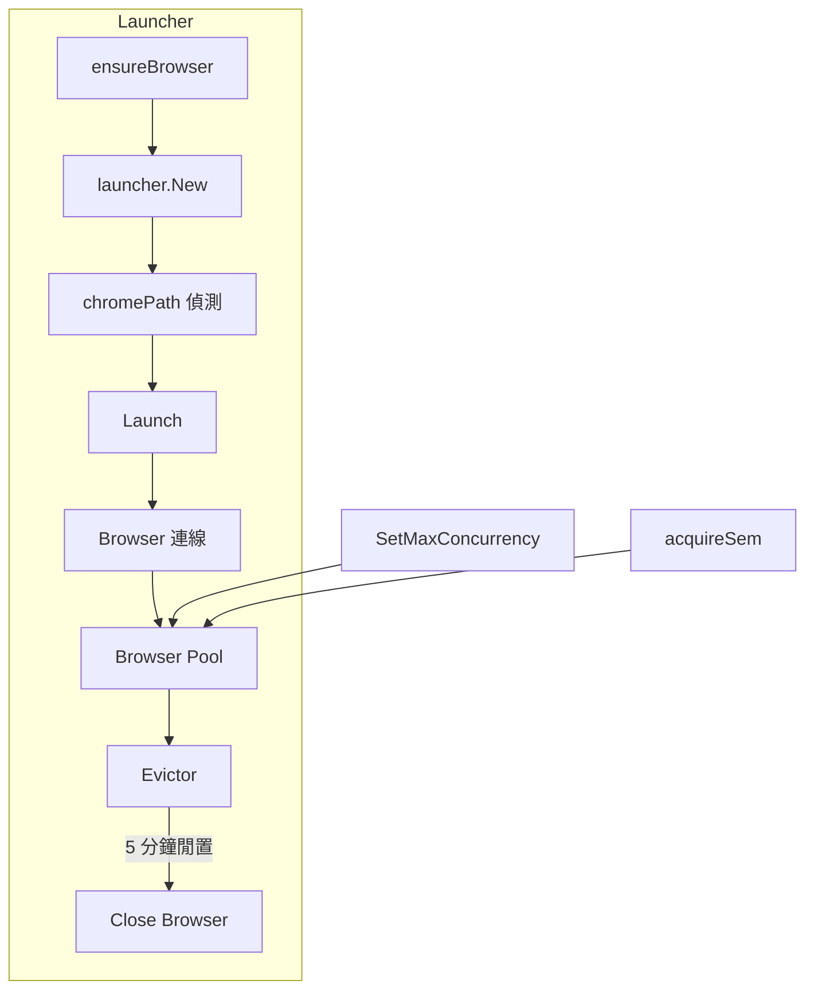
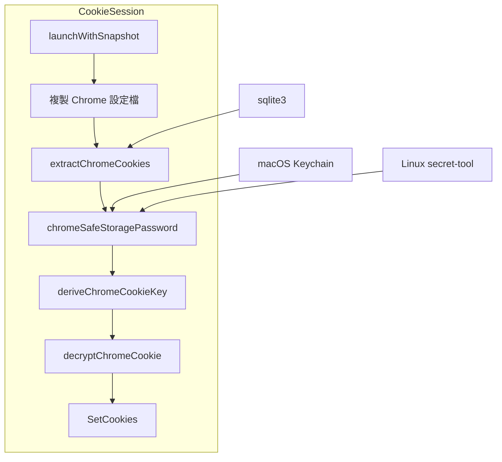
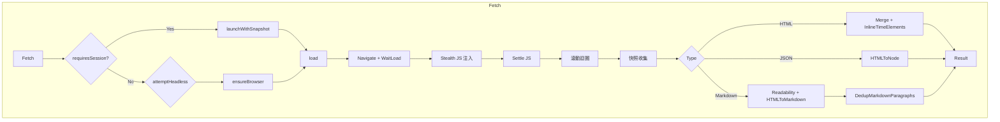
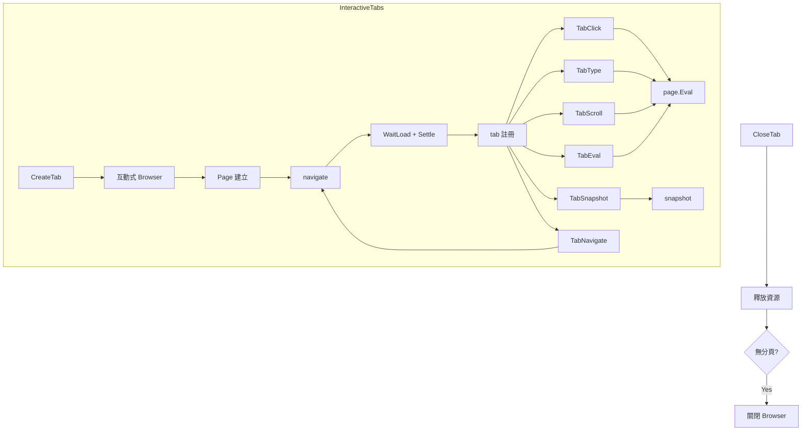
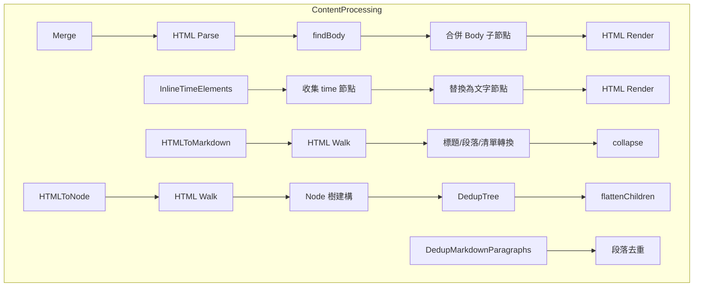
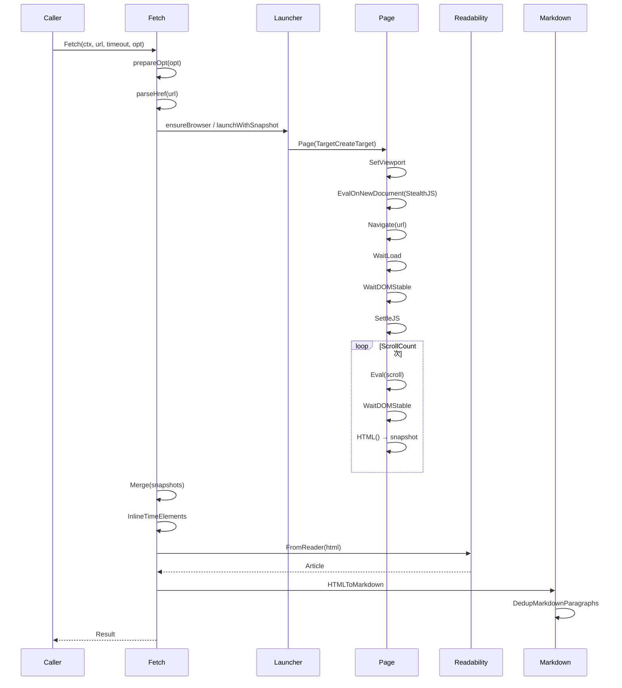
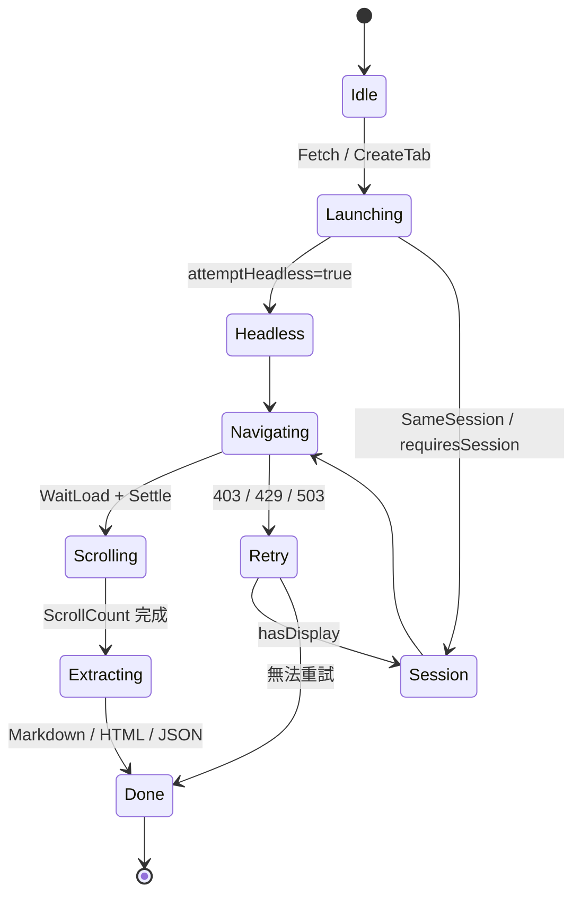

# go-browser - 架構

> 返回 [README](./README.zh.md)

## 概覽

## 模組：Launcher

負責啟動與管理 Chrome 瀏覽器實例，支援 headless 與非 headless 模式，並提供閒置自動回收機制。

## 模組：Cookie Session

從本機 Chrome 設定檔提取並解密 Cookie，注入至臨時瀏覽器實例以存取需登入的頁面。

## 模組：Fetch

核心擷取流程，負責導航、滾動、快照合併與內容提取。

## 模組：Interactive Tabs

互動式分頁管理，支援建立、點擊、輸入、滾動、執行 JavaScript 與快照擷取。

## 模組：Content Processing

HTML 處理與內容轉換，包含快照合併、時間元素內聯、Markdown 轉換與去重。

## 資料流

## 狀態機

***

©️ 2025 [邱敬幃 Pardn Chiu](https://linkedin.com/in/pardnchiu)