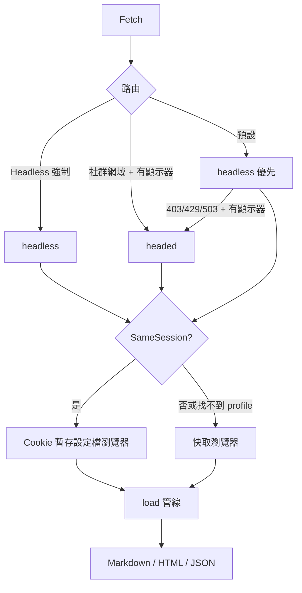
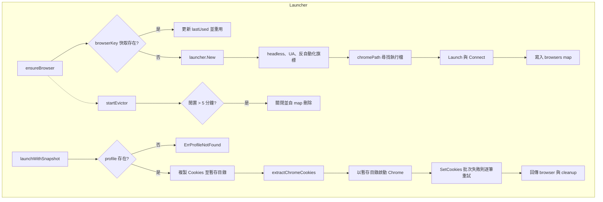
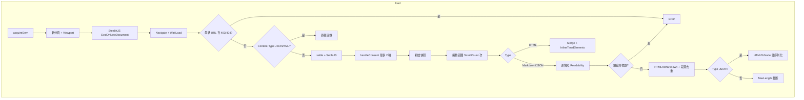
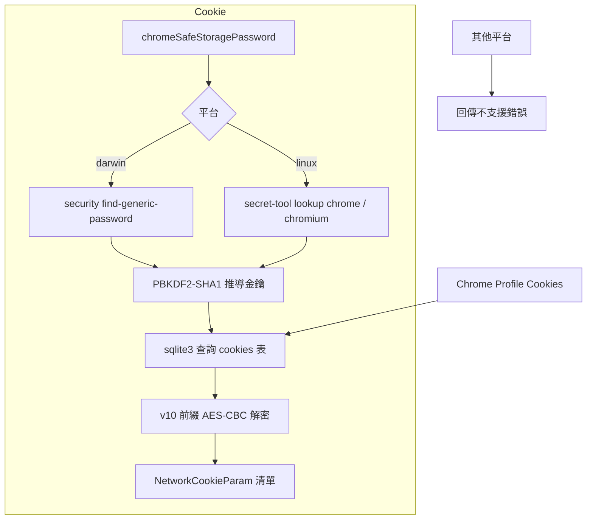
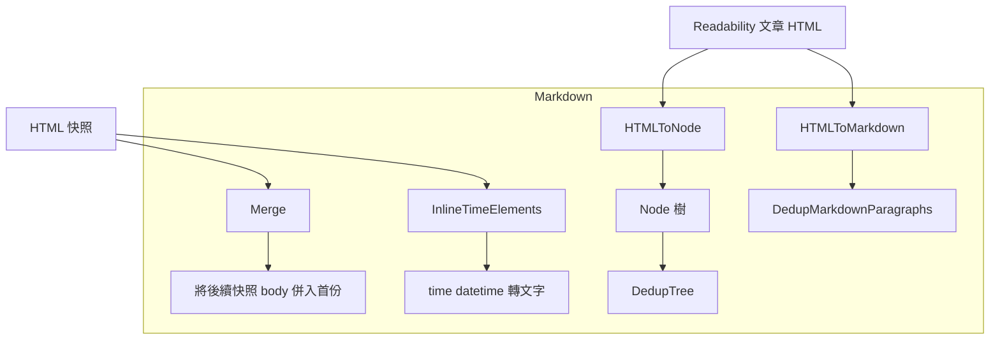
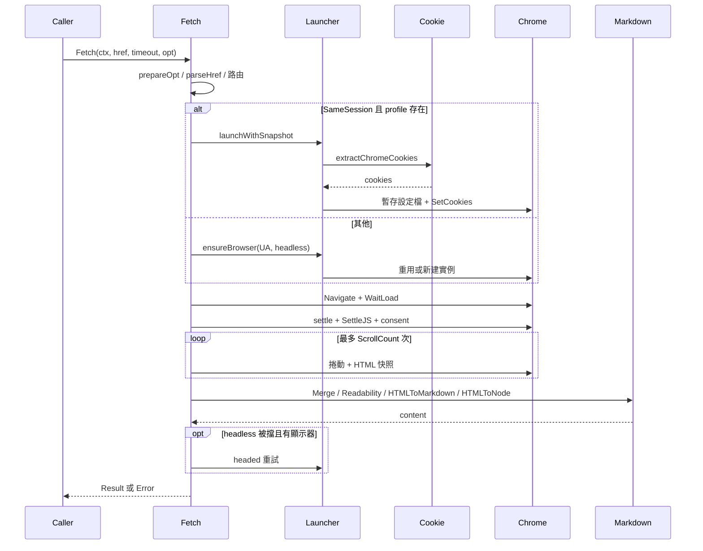
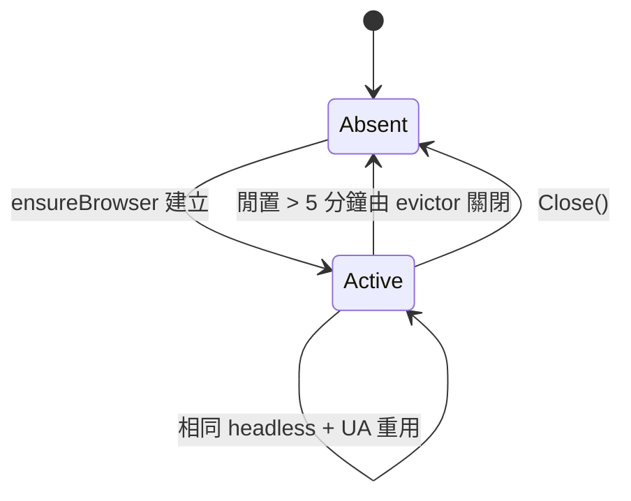

# go-browser - 架構

最後更新：2026-10-06

> 返回 [README](./README.zh.md)

## 概覽

```mermaid
graph TB
    A[Fetch] --> B{路由}
    B -->|Headless 強制| C[headless]
    B -->|社群網域 + 有顯示器| D[headed]
    B -->|預設| E[headless 優先]
    E -->|403/429/503 + 有顯示器| D
    C --> F{SameSession?}
    D --> F
    E --> F
    F -->|是| G[Cookie 暫存設定檔瀏覽器]
    F -->|否或找不到 profile| H[快取瀏覽器]
    G --> I[load 管線]
    H --> I
    I --> J[Markdown / HTML / JSON]
```

## 模組：Launcher

管理 Chrome 生命週期：依 headless 與 User-Agent 快取可重用實例，或建立注入 Cookie 的一次性暫存設定檔實例。

```mermaid
graph TB
    subgraph Launcher
        A[ensureBrowser] --> B{browserKey 快取存在?}
        B -->|是| C[更新 lastUsed 並重用]
        B -->|否| D[launcher.New]
        D --> E[headless、UA、反自動化旗標]
        E --> F[chromePath 尋找執行檔]
        F --> G[Launch 與 Connect]
        G --> H[寫入 browsers map]
        I[startEvictor] --> J{閒置 > 5 分鐘?}
        J -->|是| K[關閉並自 map 刪除]
        L[launchWithSnapshot] --> M{profile 存在?}
        M -->|否| N[ErrProfileNotFound]
        M -->|是| O[複製 Cookies 至暫存目錄]
        O --> P[extractChromeCookies]
        P --> Q[以暫存目錄啟動 Chrome]
        Q --> R[SetCookies 批次失敗則逐筆重試]
        R --> S[回傳 browser 與 cleanup]
    end
    A -.-> I
```

## 模組：Fetch

決定 headless／headed 路由，並執行導覽、穩定等待、橫幅處理、多快照擷取與格式轉換。

```mermaid
graph TB
    subgraph Fetch
        A[prepareOpt] --> B[parseHref]
        B --> C{opt.Headless?}
        C -->|是| D[fetchWith headless]
        C -->|否| E{(Visible 或 requiresSession) 且 hasDisplay?}
        E -->|是| F[fetchWith headed]
        E -->|否| G[fetchWith headless]
        G --> H{isBlocked 且 hasDisplay?}
        H -->|是| F
        H -->|否| I[回傳結果]
        D --> I
        F --> I
    end
    subgraph fetchWith
        J{SameSession?} -->|是| K[launchWithSnapshot]
        K -->|ErrProfileNotFound| L[ensureBrowser]
        J -->|否| L
        K --> M[load]
        L --> M
    end
    D -.-> J
    F -.-> J
    G -.-> J
```

## 模組：load 管線

```mermaid
graph TB
    subgraph load
        A[acquireSem] --> B[新分頁 + Viewport]
        B --> C[StealthJS EvalOnNewDocument]
        C --> D[Navigate + WaitLoad]
        D --> E{最終 URL 含 403/404?}
        E -->|是| X[Error]
        E -->|否| F{Content-Type JSON/XML?}
        F -->|是| Y[原樣回傳]
        F -->|否| G[settle + SettleJS]
        G --> H[handleConsent 最多 2 輪]
        H --> I[初始快照]
        I --> J[捲動迴圈 ScrollCount 次]
        J --> K{Type}
        K -->|HTML| L[Merge + InlineTimeElements]
        K -->|Markdown/JSON| M[逐快照 Readability]
        M --> N{驗證頁標題?}
        N -->|是| X
        N -->|否| O[HTMLToMarkdown + 段落去重]
        O --> P{Type JSON?}
        P -->|是| Q[HTMLToNode 並序列化]
        P -->|否| R[MaxLength 截斷]
    end
```

## 模組：Cookie

從本機 Chrome 設定檔解密 Cookie，供 SameSession 注入暫存瀏覽器；僅支援 darwin 與 linux。

```mermaid
graph TB
    subgraph Cookie
        A[chromeSafeStoragePassword] --> B{平台}
        B -->|darwin| C[security find-generic-password]
        B -->|linux| D[secret-tool lookup chrome / chromium]
        C --> E[PBKDF2-SHA1 推導金鑰]
        D --> E
        E --> F[sqlite3 查詢 cookies 表]
        F --> G[v10 前綴 AES-CBC 解密]
        G --> H[NetworkCookieParam 清單]
    end
    Profile[Chrome Profile Cookies] --> F
    Other[其他平台] --> Unsupported[回傳不支援錯誤]
```

## 模組：Markdown

HTML 快照合併、時間元素內嵌、結構樹轉換與去重。

```mermaid
graph TB
    subgraph Markdown
        A[Merge] --> B[將後續快照 body 併入首份]
        C[InlineTimeElements] --> D[time datetime 轉文字]
        E[HTMLToNode] --> F[Node 樹]
        F --> G[DedupTree]
        H[HTMLToMarkdown] --> I[DedupMarkdownParagraphs]
    end
    Snapshots[HTML 快照] --> A
    Snapshots --> C
    Article[Readability 文章 HTML] --> E
    Article --> H
```

## 資料流

```mermaid
sequenceDiagram
    participant Caller
    participant Fetch
    participant Launcher
    participant Cookie
    participant Chrome
    participant Markdown
    Caller->>Fetch: Fetch(ctx, href, timeout, opt)
    Fetch->>Fetch: prepareOpt / parseHref / 路由
    alt SameSession 且 profile 存在
        Fetch->>Launcher: launchWithSnapshot
        Launcher->>Cookie: extractChromeCookies
        Cookie-->>Launcher: cookies
        Launcher->>Chrome: 暫存設定檔 + SetCookies
    else 其他
        Fetch->>Launcher: ensureBrowser(UA, headless)
        Launcher->>Chrome: 重用或新建實例
    end
    Fetch->>Chrome: Navigate + WaitLoad
    Fetch->>Chrome: settle + SettleJS + consent
    loop 最多 ScrollCount 次
        Fetch->>Chrome: 捲動 + HTML 快照
    end
    Fetch->>Markdown: Merge / Readability / HTMLToMarkdown / HTMLToNode
    Markdown-->>Fetch: content
    opt headless 被擋且有顯示器
        Fetch->>Launcher: headed 重試
    end
    Fetch-->>Caller: Result 或 Error
```

## 狀態機：快取瀏覽器

```mermaid
stateDiagram-v2
    [*] --> Absent
    Absent --> Active: ensureBrowser 建立
    Active --> Active: 相同 headless + UA 重用
    Active --> Absent: 閒置 > 5 分鐘由 evictor 關閉
    Active --> Absent: Close()
```

***

©️ 2026 [邱敬幃 Pardn Chiu](https://www.linkedin.com/in/pardnchiu)
